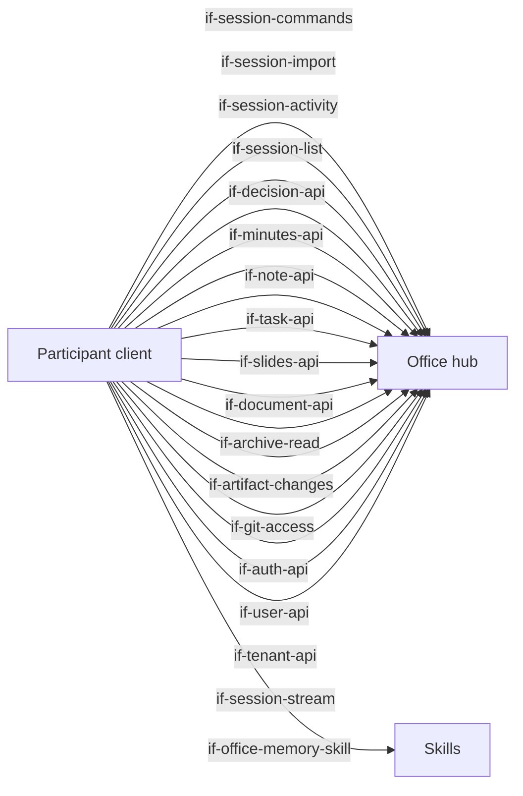
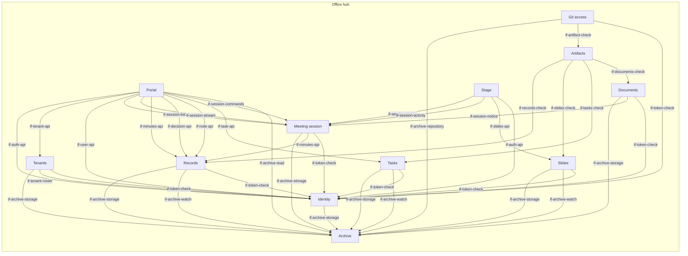
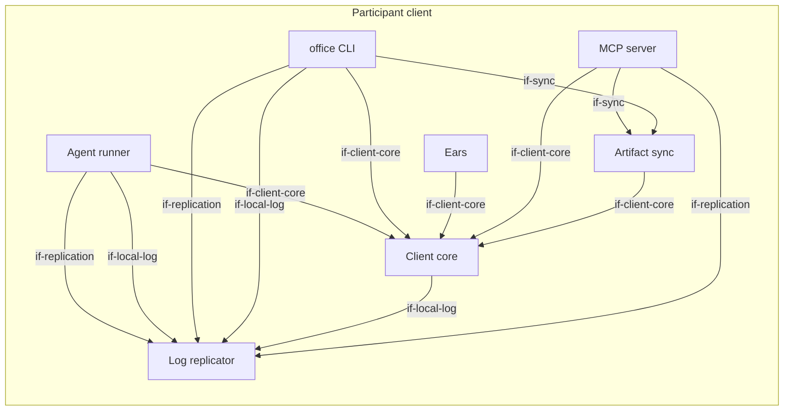

# Building Block View

The diagram shows every dependency between building blocks: an arrow is an interface that a
block lists in `requires`, pointing to the provider. The architecture test enforces exactly these
dependencies in the code (`concept-module-boundaries`). Every building block and every interface
has its own path; no two share one. Interfaces that only external actors use (CLI, MCP, stage
view, audio input) are in chapter 3.

At the top level the system has three parts. The **office hub** manages sessions, the records of
the team (decisions, minutes and notes), the tasks, the slide decks and the stage. The **participant client** runs on the computer of every participant,
human or agent. The **skills** carry the conventions of the office to every agent.

## Overview

```arc42
:::diagram
id: bb-overview
view: building-block
notation: mermaid
roots: bb-office-hub, bb-participant-client, bb-skills
aliases: bb_skills=bb-skills, bb_office_hub=bb-office-hub, bb_participant_client=bb-participant-client
:::
```


```mermaid
flowchart LR
    bb_skills[Skills]
    bb_office_hub[Office hub]
    bb_participant_client[Participant client]
    bb_participant_client -->|if-session-commands| bb_office_hub
    bb_participant_client -->|if-session-import| bb_office_hub
    bb_participant_client -->|if-session-activity| bb_office_hub
    bb_participant_client -->|if-session-list| bb_office_hub
    bb_participant_client -->|if-decision-api| bb_office_hub
    bb_participant_client -->|if-minutes-api| bb_office_hub
    bb_participant_client -->|if-note-api| bb_office_hub
    bb_participant_client -->|if-task-api| bb_office_hub
    bb_participant_client -->|if-slides-api| bb_office_hub
    bb_participant_client -->|if-document-api| bb_office_hub
    bb_participant_client -->|if-archive-read| bb_office_hub
    bb_participant_client -->|if-artifact-changes| bb_office_hub
    bb_participant_client -->|if-git-access| bb_office_hub
    bb_participant_client -->|if-auth-api| bb_office_hub
    bb_participant_client -->|if-user-api| bb_office_hub
    bb_participant_client -->|if-tenant-api| bb_office_hub
    bb_participant_client -->|if-session-stream| bb_office_hub
    bb_participant_client -->|if-office-memory-skill| bb_skills
```

## Office hub

The central, headless part. It holds the state of the team and of running meetings, offers
deterministic tools and renders the stage. It is the gateway to the archive. It contains no LLM.

```arc42
:::building-block
id: bb-office-hub
title: Office hub
technology: Go (monorepo)
implements: concept-event-log, concept-participant-model, concept-module-boundaries
path: hub
:::
```

White box: the parts of the office hub and how they use each other. An arrow to a part that
realizes an interface of the office hub points to that part.

```arc42
:::diagram
id: bb-office-hub-whitebox
view: building-block
notation: mermaid
roots: bb-office-hub
aliases: bb_office_hub=bb-office-hub, bb_portal=bb-portal, bb_archive=bb-archive, bb_artifacts=bb-artifacts, bb_documents=bb-documents, bb_git_access=bb-git-access, bb_identity=bb-identity, bb_records=bb-records, bb_session_service=bb-session-service, bb_slides=bb-slides, bb_stage=bb-stage, bb_tasks=bb-tasks, bb_tenants=bb-tenants
:::
```


```mermaid
flowchart LR
    subgraph bb_office_hub [Office hub]
        bb_portal[Portal]
        bb_archive[Archive]
        bb_artifacts[Artifacts]
        bb_documents[Documents]
        bb_git_access[Git access]
        bb_identity[Identity]
        bb_records[Records]
        bb_session_service[Meeting session]
        bb_slides[Slides]
        bb_stage[Stage]
        bb_tasks[Tasks]
        bb_tenants[Tenants]
    end
    bb_portal -->|if-auth-api| bb_identity
    bb_portal -->|if-tenant-api| bb_tenants
    bb_portal -->|if-user-api| bb_identity
    bb_portal -->|if-session-list| bb_session_service
    bb_portal -->|if-session-stream| bb_session_service
    bb_portal -->|if-minutes-api| bb_records
    bb_portal -->|if-decision-api| bb_records
    bb_portal -->|if-note-api| bb_records
    bb_portal -->|if-task-api| bb_tasks
    bb_portal -->|if-session-commands| bb_session_service
    bb_portal -->|if-archive-read| bb_archive
    bb_documents -->|if-archive-storage| bb_archive
    bb_documents -->|if-session-notice| bb_session_service
    bb_documents -->|if-token-check| bb_identity
    bb_records -->|if-archive-storage| bb_archive
    bb_records -->|if-archive-watch| bb_archive
    bb_records -->|if-token-check| bb_identity
    bb_session_service -->|if-archive-storage| bb_archive
    bb_session_service -->|if-minutes-api| bb_records
    bb_session_service -->|if-token-check| bb_identity
    bb_slides -->|if-archive-storage| bb_archive
    bb_slides -->|if-archive-watch| bb_archive
    bb_slides -->|if-token-check| bb_identity
    bb_stage -->|if-session-stream| bb_session_service
    bb_stage -->|if-session-activity| bb_session_service
    bb_stage -->|if-slides-api| bb_slides
    bb_stage -->|if-auth-api| bb_identity
    bb_tasks -->|if-archive-storage| bb_archive
    bb_tasks -->|if-archive-watch| bb_archive
    bb_identity -->|if-archive-storage| bb_archive
    bb_tasks -->|if-token-check| bb_identity
    bb_tenants -->|if-archive-storage| bb_archive
    bb_tenants -->|if-tenant-roster| bb_identity
    bb_tenants -->|if-token-check| bb_identity
    bb_git_access -->|if-archive-repository| bb_archive
    bb_git_access -->|if-artifact-check| bb_artifacts
    bb_artifacts -->|if-records-check| bb_records
    bb_artifacts -->|if-slides-check| bb_slides
    bb_artifacts -->|if-tasks-check| bb_tasks
    bb_artifacts -->|if-documents-check| bb_documents
    bb_git_access -->|if-token-check| bb_identity
```

### Session commands

The synchronous way to act in a session: join and leave, say something or mark a sentence off the
record, pause, raise a hand, update the minutes, focus an artifact, end the session. Each
successful call creates exactly one event in the log, and each call carries an ID created by the
client, so a repeated call has no extra effect and a client may always repeat after a drop.

The same interface carries the release of an ended session (`concept-session-release`): release
and object. Only a human who took part in the session may call them, also after leaving; an agent
is refused. The answer to the end says when the hub releases the session. An ended session takes
only these commands, notices about artifacts and, until the release, a mark off the record
(`dec-session-end-milestone`); the hub stores such an event before it answers. Ending and releasing
in one step are two calls, one event each.

Before it releases, the hub searches the staged files for sentences off the record, word for word.
While it finds one, it refuses and creates no event. The answer lists each place (the file, the
line and the event of the sentence, never the sentence) and a token: a hash over the session and
the exact quotes. To release anyway, the human sends the release again with this token. The hub
searches again and releases only if the search gives the same token, so a staged file that changed
in between leads to a new refusal with a new token.

The interface also tells who may read a session its release: the status and deadline, the staged
files, whether the caller may release or object now, and, once released, the release commit with
the human who released and the authors of the artifacts. Every other member of the tenant gets
only the release of a released session.

The same interface lets everyone who may read a session check its log (`dec-merkle-log`): it hands
out signed tree heads, proofs and the public key of the hub. It owns no log types. The events, the tree
heads and the code that verifies them belong to the session stream, which owns the event log.

After a restart, a peer offers its copy of a session log through this interface
(`dec-restore-from-peers`). The hub accepts a copy only if it verifies and extends its own log. A
copy that is not longer has no effect, and a copy that does not verify or forks fails, so a peer
can never rewrite history.

```arc42
:::interface
id: if-session-commands
title: Session commands
provider: bb-office-hub
x-realized-by: bb-session-service
protocol: Connect RPC, unary (dec-connect-rpc)
path: hub/session/commandsapi
:::
```

### Session stream

Delivers the event log of a session from a cursor onwards, then live. It is the one basis for the
local replication, the stage and the portal, so every reader sees the same log. Only those who may
read the session get it: everyone who ever joined it, the participant who imported it, the tenant
admins, and a stage link of this session (`concept-multi-tenancy`). For anybody else the session
does not exist. After a drop, the
subscriber reconnects with its last event ID. A one-time request for the events after a cursor
serves a participant that finds a gap in its copy, or that follows the session without a file
system (`dec-events-from-cursor`). With its last event, the stream sends a tree head signed by the
hub over everything up to it, so a subscriber always holds a signed head over its whole copy
(`dec-signed-head-in-stream`). A cursor beyond the end of the log means that the hub lost events;
the subscriber then offers its copy.

The live stream ends with the end of the session. The events that an ended session still takes
(changes of the release status, notices about artifacts and marks off the record) come only with a
one-time request for the events after a cursor (`dec-session-end-milestone`). A change of the
release status without an actor comes from the hub: a release when the grace period ends, or a
hold because staged files quote sentences off the record.

The interface owns the event log: the event types, the signed tree head and the code that builds
and verifies the Merkle tree (`dec-merkle-log`). The other interfaces return events and tree heads
of these types. The stored form of a session log is the same as the local one
(`dec-yaml-git-storage`), so every reader can rebuild a log and check it against its tree head
with this interface alone.

```arc42
:::interface
id: if-session-stream
title: Session stream (replication from a cursor)
provider: bb-office-hub
x-realized-by: bb-session-service
protocol: Connect RPC, server streaming (dec-connect-rpc)
path: hub/session/streamapi
:::
```

### Session import

Imports a whole conversation that happened outside the office as a new session
(`dec-session-import`): a meeting in another tool, a chat, or a conversation with an agent. It
takes the source, the participants and the utterances in order, in one call or in pages. Each page
carries an ID created by the client, so a repeated page has no extra effect.

The import only fills the log. The meeting session writes its events like those of live commands,
so the log keeps one writer, and the other interfaces treat an imported session like any other
once the import is complete. The first event marks the session as imported, so nobody mistakes it
for a live one. Until the import is complete, only the participant who started it may add pages.

The speakers of an imported conversation are not registered participants: the hub cannot check who
they are. So their IDs are marked as imported and never match a registered participant. The
signature of the hub proves which participant imported the log and that it has not changed since;
it does not prove that the speakers said what the log says.

```arc42
:::interface
id: if-session-import
title: Session import
provider: bb-office-hub
x-realized-by: bb-session-service
protocol: Connect RPC, unary (dec-connect-rpc)
path: hub/session/importapi
:::
```

### Session activity

What a participant is doing right now, for the people in the meeting (`dec-agent-activity`): an
agent works, which tool it calls, waits, or ended its turn with a reply that nobody heard. A
participant reports its own activity; the stage watches the activities of its session.

The activity is short-lived and is no event of the log. The hub keeps only the latest activity of
each participant, in memory, and never stores, archives or replicates it. A report lives a short
time unless the participant renews it, and it ends when the participant leaves or the session
ends. A report names a tool by a short name only, never by its arguments, because arguments can
carry sentences that are off the record.

```arc42
:::interface
id: if-session-activity
title: Session activity
provider: bb-office-hub
x-realized-by: bb-session-service
protocol: Connect RPC, unary and server streaming (dec-connect-rpc); in-process for the stage
path: hub/session/activityapi
:::
```

### Session list

The sessions of a tenant that the caller may see (`dec-web-portal`), the newest first: the name,
the start, the end or that the session runs, the participants, and whether it was imported. A
session is visible to everyone who joined it, to the participant who imported it, and to the
tenant admins of its tenant. A system admin is no member of a tenant and sees none. The list
covers running sessions and ended sessions that only the archive holds; it reads a stored log only
after it verified it against its signed tree head. The events of one session come from the session
stream.

```arc42
:::interface
id: if-session-list
title: Session list
provider: bb-office-hub
x-realized-by: bb-session-service
protocol: Connect RPC, unary (dec-connect-rpc); in-process for the portal
path: hub/session/listapi
:::
```

### Auth API

Proves who a caller is: the client signs a challenge from the hub with its private key and gets a
short-lived access token that is bound to its key. The answer names the participant and the
display name of the participant, which the client uses as the author of commits
(`dec-artifact-sync`). The interface also creates the read-only links
for the stage and the one-time links of the portal (`dec-web-portal`). The calls of the meeting session, the records, the tasks and the slides name a
tenant, and Identity checks that the caller is a member of it. The auth, user and tenant APIs name
no tenant, because they work across tenants.

```arc42
:::interface
id: if-auth-api
title: Auth API
provider: bb-office-hub
x-realized-by: bb-identity
protocol: Connect RPC, unary (dec-connect-rpc)
path: hub/identity/api
:::
```

### User API

Manages users in two steps, because a user is global and a membership belongs to a tenant. First
the user and its keys are registered at the hub. Then the user is assigned to tenants with a role,
and system admins are named. A system admin may do everything, a tenant admin only the memberships
of their own tenant, and everyone else only their own keys. Every change is checked against the
rules in `concept-multi-tenancy` and refused if it breaks one. A user ID is never used again.

```arc42
:::interface
id: if-user-api
title: User API
provider: bb-office-hub
x-realized-by: bb-identity
protocol: Connect RPC, unary (dec-connect-rpc)
path: hub/identity/userapi
:::
```

### Tenant API

Creates, lists and removes tenants; only a system admin may. Creating a tenant gives it its own
repository and names its first tenant admin.

```arc42
:::interface
id: if-tenant-api
title: Tenant API
provider: bb-office-hub
x-realized-by: bb-tenants
protocol: Connect RPC, unary (dec-connect-rpc)
path: hub/tenant/api
:::
```

### Decisions

Records decisions and lists them in order, by session and from a cursor. A decision keeps its
author and whether the author is a human or an agent. Each command carries an ID created by the
client, so a repeated command has no extra effect. A sentence that is off the record must not go
into a decision (`dec-off-the-record`).

A decision that names a session waits for the release of that session (`concept-session-release`).
Until then, every participant of the session may change or remove it, and only the readers of the
session see its content; everyone else sees its stub. A released decision never changes.

```arc42
:::interface
id: if-decision-api
title: Decisions
provider: bb-office-hub
x-realized-by: bb-records
protocol: Connect RPC, unary (dec-connect-rpc)
path: hub/records/decision/api
:::
```

### Minutes

The minutes of a session. While the session runs, participants write the running minutes through
the session commands. When the session ends, the meeting session stores the last version through
this interface (`rs-session-ends`). The stored minutes wait for the release of the session
(`concept-session-release`). Until then, every participant of the session may change or remove
them here, and only the readers of the session see them; everyone else sees their stub. Clients
never create minutes here. A sentence that is off the record must not go into the minutes.

The meeting session stores the minutes while it ends the session. This one write does not ask the
meeting session back: the meeting session states that the session is not released and that the
minute taker took part. So the records part and the meeting session never wait for each other.

```arc42
:::interface
id: if-minutes-api
title: Minutes
provider: bb-office-hub
x-realized-by: bb-records
protocol: Connect RPC, unary (dec-connect-rpc); in-process for the meeting session
path: hub/records/minutes/api
:::
```

### Notes

Adds free notes, with or without a session, and lists them like the decisions. A note is
Markdown text with optional tags. It keeps its author, whether the author is a human or an agent,
the time and the session, if any. A note is a
memory: once it is released, it never changes; a correction is a new note that refers to the old
one. A note that names a session waits for the release of that session, like a decision, and
until then every participant of the session may change or remove it. Notes are sources of the wiki (`dec-wiki`, `concept-wiki`). A sentence that is off the record must not go into a
note. Ingest copies notes into documents, so the hub cannot remove a sentence that is marked off
the record later from those copies.

```arc42
:::interface
id: if-note-api
title: Notes
provider: bb-office-hub
x-realized-by: bb-records
protocol: Connect RPC, unary (dec-connect-rpc)
path: hub/records/note/api
:::
```

### Tasks

Creates and changes tasks and lists them by status, assignee and session. A task keeps its author,
whether the author is a human or an agent, and who changed it last. Each command carries an ID
created by the client, so a repeated command has no extra effect. A sentence that is off the
record must not go into a task.

Every task is a local draft of the hub (`dec-yaml-git-storage`). A sync with the task tool of the
team would replace the draft by the synced task. So that this step does not change the contract, a
task is named by a stable reference with a scheme, for example `local:42` or
`github:owner/repo#12`. Clients treat the reference as opaque: they keep it and pass it back. Each
task also says where it lives. OPEN: how a synced task replaces its draft, and which side is the
truth.

```arc42
:::interface
id: if-task-api
title: Tasks
provider: bb-office-hub
x-realized-by: bb-tasks
protocol: Connect RPC, unary (dec-connect-rpc)
path: hub/tasks/api
:::
```

### Slides

Renders a slide deck from a structured description and returns a deck by its ID, with its input
and its rendered output. A deck keeps its author and whether the author is a human or an agent.
Each command carries an ID created by the client, so a repeated command has no extra effect.
Rendering is deterministic (`con-no-intelligence`): the same input gives the same output, so the
hub stays free of a model. A sentence that is off the record must not go into a deck.

A deck has an ID with the type in front, for example `slides/42`, and the stage shows a deck by
this ID. In general, an artifact is anything that the stage can show by an ID like this; slide
decks are the first type (`term-artifact`).

A render may name a session, and the deck keeps it. A deck that names a session waits for the
release of that session (`concept-session-release`). Until then, every participant of the session
may change or remove it, and only the readers of the session see its content; everyone else sees
its stub. The stage sees the decks of its own session.

```arc42
:::interface
id: if-slides-api
title: Slides
provider: bb-office-hub
x-realized-by: bb-slides
protocol: Connect RPC, unary (dec-connect-rpc); in-process for the stage
path: hub/slides/api
:::
```

### Documents

Creates and changes text documents: Markdown files without a schema (`dec-artifacts`). The path is
the identity of a document. A change names the version that its author read, and the hub refuses
it when another change came first, so two authors never overwrite each other unnoticed. The
archive records the caller as the author of the commit. A call may name a session; the hub then
tells the meeting session, which logs it. A sentence that is off the record must not go into a
document; the hub cannot check this, so the author takes care of it.

A new document that names a session waits for the release of that session
(`concept-session-release`). Until then, every participant of the session may change or remove it,
and each change must name that session. A change of a released document is not held. A staged
document is read through the archive read interface, which shows its content only to the readers
of the session.

A document may name the schema of documents in its front matter (`dec-wiki`). Then the hub checks
the fields of the front matter, all optional: a title and a summary of one line each, tags, the
sources it draws on as paths of records, a status (draft, reviewed or outdated), an owner, and
the reviews it got, each with the reviewer and the day. Any other field is invalid. A create or a
change with invalid front matter, or with front matter that names another schema, is refused with
the reasons. A document without front matter is valid, and its first heading is its title. The
rules are the same as for a push, because the check is the same.

A create or a change answers with a hint for every relative Markdown link of the document that
leads to no file of the artifact repository. A stub counts as a file, so a link to a staged
document works. A hint never refuses the write.

```arc42
:::interface
id: if-document-api
title: Documents
provider: bb-office-hub
x-realized-by: bb-documents
protocol: Connect RPC, unary (dec-connect-rpc)
path: hub/documents/api
:::
```

### Portal

A browser view for every user of the hub (`dec-web-portal`), opened by a link that the user creates
with the CLI. The link works once and is swapped for an access token that the scripts of the page
cannot read. It shows what the key of the user may see: the sessions in which the user took part,
read-only, with their transcript and their artifacts; the minutes, notes, decisions, tasks, slides
and documents of the tenant; for a tenant admin, every session and the members of the tenant; for a
system admin, the users with their keys, the tenants and the system admins, with the forms to
register users and keys and to revoke keys. The tenant is part of the address of a page. It has the
same design as the stage.

The page of a session shows its readers the release status, when the hub releases it, and the
staged artifacts. A human who took part gets two forms: release, and, while the session waits,
object. When the hub refuses a release because staged files quote sentences off the record, the
page lists the places and a button "release anyway" whose form carries the token. A member who did
not take part sees a session only once it is released, and then only the released artifacts, who
released them and their original authors.

```arc42
:::interface
id: if-portal-web
title: Portal
provider: bb-office-hub
x-realized-by: bb-portal
protocol: HTTPS (browser)
path: hub/portal/web
:::
```

### Portal part

The portal part renders the portal on the server. It has no logic and no state of its own: every
page asks the interfaces of the hub with the access token of the user and shows what it gets, so the
portal has exactly the rights of the key (`dec-web-portal`). It asks the auth API who the user is,
the user and tenant APIs for the administration and the members, the session list for the
sessions of a tenant, the session stream for the events of one session, and the minutes, decisions,
notes and tasks of that session. On the page of a session it asks the session commands for the
release and the archive read API for the staged or released artifacts, and its forms send release
and objection to the session commands.

```arc42
:::building-block
id: bb-portal
title: Portal
technology: Go, rendered by the hub
parent: bb-office-hub
requires: if-auth-api, if-user-api, if-tenant-api, if-session-list, if-session-stream, if-session-commands, if-minutes-api, if-decision-api, if-note-api, if-task-api, if-archive-read
path: hub/portal
:::
```

### Stage view

A browser view of one session, opened by a link.

```arc42
:::interface
id: if-stage-web
title: Stage view
provider: bb-office-hub
x-realized-by: bb-stage
protocol: HTTPS (browser)
path: hub/stage/web
:::
```

### Health check

A plain address for container platforms and load balancers. It needs no token, reads no state and
has no side effects. It answers on the TLS port of the hub, so it shows that the handshake and the
HTTP server work, not only that the port is open.

```arc42
:::interface
id: if-health
title: Health check
provider: bb-office-hub
protocol: HTTPS (GET /healthz)
path: hub/health
:::
```

### Meeting session

Manages sessions and their participants. It accepts utterances from the ears and actions from
participants, and writes everything to one append-only event log per session. It also takes
imported conversations (`if-session-import`) and writes them into the log of a new session, so a
session log has one writer in every case. Next to the log, it keeps the short-lived activities of
the participants (`if-session-activity`), in memory only. Subscribers receive the log from a cursor onwards.
It lists the sessions that a caller may see (`if-session-list`).
Events are merged by time only: the participant model already says who spoke.

It owns the release of each session (`concept-session-release`, `dec-staging-repository`):

- When a session starts, it opens the staging area of the session and makes every participant who
  joins a reader of it; the participant who imports a session is one too.
- When the session ends, it writes the deadline into the staging area once: the end itself if no
  human took part, otherwise the end plus the grace period of the tenant.
- One worker per tenant keeps the deadlines in memory and rebuilds them from the staging
  repository at start. A deadline that passed while the hub was down, and a release that a restart
  cut off, are done at start. The worker loads an ended session that left memory when it needs it.
- An objection holds the session, and the staging area records it. Only a human releases a held
  session.
- The release is an event in the log first, then the archive moves the area with the human who
  released, or the hub, as the author. Before every release of a session with humans, it searches
  the staged files for word-for-word quotes of sentences off the record. It knows no file type and
  changes no content. A human releases despite quotes only with the token of the quotes found. When
  the grace period ends while quotes exist, it holds the session instead of releasing it.

```arc42
:::building-block
id: bb-session-service
title: Meeting session
technology: Go / connect-go
parent: bb-office-hub
implements: concept-event-log, concept-participant-model, concept-identity, concept-session-release
requires: if-minutes-api, if-token-check, if-archive-storage
path: hub/session
:::
```

#### Session release

Tells the parts of the hub that write artifacts for a session whether the session is released,
and whether a participant took part in it. The release status decides where a write goes: into the
staging area of the session while it is not released, else into the artifact repository. Every
session that exists has a status, also one that staged nothing: open while it runs, waiting until
its deadline, held after an objection, or released. Only a participant who took part may name a
session in a write: one who joined it at any time, or the participant who imported it. The session
notice accepts the same participants.

```arc42
:::interface
id: if-session-release
title: Session release
provider: bb-session-service
protocol: In-process Go call
path: hub/session/release
:::
```

#### Session notice

Lets a part of the hub that writes artifacts tell the session about it. The session logs the
change for the participant who wrote, who must have taken part in the session by the same rule as
the session release: joined at any time, or imported it. So a write that passes the check of the
session release never fails on the notice afterwards.

```arc42
:::interface
id: if-session-notice
title: Session notice
provider: bb-session-service
protocol: In-process Go call
path: hub/session/notice
:::
```

The meeting session writes the log of every session that changed to the archive, at an interval
and when the session ends (`dec-session-persistence`); the end of an import also starts a write.
The write runs in the background, so commands and the stream never wait for it, and a slow write
makes the next one take everything that has come since. Every write stores the raw log, with the
original text of sentences that are off the record, and the tree head signed by the hub over
exactly that log (`dec-merkle-log`).

When the hub starts, the meeting session reads every stored log back and checks it against its
signed tree head before it uses it (`dec-restore-from-peers`). A restored session keeps its IDs, so
every cursor stays valid. The events after the last write are lost; a peer fills them in. Until a
peer copy fits, or a wait is over, a restored session that has not ended takes no commands
(`dec-signed-head-in-stream`). The archive also records whether the hub stopped after a last write
of every session; then nothing is lost and there is no wait.

### Records

The memory of the team: decisions, minutes and notes (`dec-records-per-type`). Each type has its
own interface and its own types, and each record keeps who wrote it and whether that was a human
or an agent. Decisions, minutes and notes are the sources of the wiki (`dec-wiki`). Tasks are not part of this block; they have their own part of the hub.

Decisions and minutes are YAML files. A note is a Markdown file whose front matter names the
schema, the author, whether the author is a human or an agent, the time, the session, if any, and
the tags; its body is the text of the note (`dec-wiki`). So a clone of the tenant opens the notes
as readable pages. Every new record is one commit in the archive (`dec-yaml-git-storage`). A command returns only
after its commit, so a record that a client got back is stored. Local commits are fast, so this
does not slow the meeting; the commit of the minutes is part of ending a session. The block reads
its records back from the archive at start, so they survive a restart. It also reloads a record file
that a push changed or added (`if-archive-watch`), and it never overwrites a file that a push put
there first: it reloads and takes the next free ID.

It routes every write that names a session (`concept-session-release`):

- Only a participant of the session may name it. The block asks the meeting session
  (`if-session-release`).
- A new record goes into the staging area of the session while the session is not released.
  Otherwise, and without a session, it goes into the artifact repository.
- For each staged record, the block writes a stub of its type into the artifact repository. Every
  stub of a type has the same content, names no session and no time, and its commit is by the hub
  with a message that says nothing about the record. No interface changes a stub.
- Until the release, every participant may change or remove a staged record. A change that names
  another session, or no session, is refused, and so is a write when the release status and the
  staging area disagree. A released record never changes.
- A staged record shows its content only to the readers of its session and to the tenant admins,
  whose role comes from the token check. Everyone else sees the stub.
- It follows the staging repository like the artifact repository (`if-archive-watch`).

The meeting session stores the minutes through this block while it ends a session. That write
does not ask the meeting session back, so the two blocks never call each other in a loop.

```arc42
:::building-block
id: bb-records
title: Records (decisions, minutes, notes)
technology: Go / YAML and Markdown in the archive
parent: bb-office-hub
path: hub/records
requires: if-token-check, if-archive-storage, if-archive-watch, if-session-release
implements: concept-wiki, concept-session-release
:::
```

#### Records check

Lets the artifacts part check a file of a record type (decision, minutes or note) before it accepts a push. A decision or minutes is
checked as YAML, and a note as Markdown with front matter and a text in its body. The part owns the schemas of
its types, and the same check serves its own interface, so every rule exists once. A schema has a
second form: the stub of a staged record (`concept-session-release`). Every stub of a type has the
same content, and the check accepts exactly that content at the path of a record of the type. The
part also tells whether a content is the stub of a type. The part names the schemas that it owns. A
call gives the path, the content and the name of the schema; the part answers that the file is
valid, or that it is invalid, with the reasons in plain words.

```arc42
:::interface
id: if-records-check
title: Records check
provider: bb-records
protocol: In-process Go call
path: hub/records/check
:::
```

### Tasks part

Keeps the tasks of the team behind the task interface (`dec-records-per-type`). Every change is
one commit, so the archive keeps the history of every task, and a command returns only after its
commit. Like the records part, it writes synchronously, and it reloads a task file that a push changed or
added (`if-archive-watch`). A sync with the task tool of the team would belong to this block, and only the hub would
hold the credentials of that tool.

```arc42
:::building-block
id: bb-tasks
title: Tasks
technology: Go / YAML in the archive
parent: bb-office-hub
path: hub/tasks
requires: if-token-check, if-archive-storage, if-archive-watch
:::
```

#### Tasks check

Lets the artifacts part check a file of a task before it accepts a push. The part owns the schemas of
its types, and the same check serves its own interface, so every rule exists once. The part names the schemas that it owns. A call
gives the path, the content and the name of the schema; the part answers that the file is valid, or
that it is invalid, with the reasons in plain words.

```arc42
:::interface
id: if-tasks-check
title: Tasks check
provider: bb-tasks
protocol: In-process Go call
path: hub/tasks/check
:::
```

### Documents part

The documents part stores each text document as one Markdown file in the archive and one commit
per change. It checks the base version of a change and tells the meeting session when a call names
one. Documents are the pages of the wiki (`dec-wiki`).

It routes every write that names a session like the records part (`concept-session-release`):

- Only a participant of the session may name it. The part asks the meeting session
  (`if-session-release`).
- A new document goes into the staging area of the session while the session is not released.
  Otherwise, and without a session, it goes into the artifact repository.
- For each staged document, the part writes the stub of a document into the artifact repository.
  Every stub of a document has the same content: Markdown whose front matter names the schema of
  documents and marks it as a stub. It names no session and no time, and its commit is by the hub
  with a message that says nothing about the document. No interface changes a stub.
- Until the release, every participant may change or remove a staged document. A change that names
  another session, or no session, is refused, and so is a write when the release status and the
  staging area disagree. A change of a released document goes to the artifact repository and is
  not held.

The part keeps no documents in memory: it reads the state of a path from the archive at each
write. If it cannot write the stub of a document that it has just staged, because a push took the
path first, it takes the staged document back, and the staging area forgets the path.

The part owns the schema of documents. Most documents name no schema and are plain Markdown. A
document may name the schema; the stub always does. The part checks the front matter of a
document that names the schema with its own check interface, at its interface and for a push, so
every rule exists once. After a write it finds the relative links of the document that lead to
no file and answers with a hint for each; it never refuses a write for a link
(`concept-wiki`).

```arc42
:::building-block
id: bb-documents
title: Documents
technology: Go / Markdown in the archive
parent: bb-office-hub
requires: if-token-check, if-archive-storage, if-session-notice, if-session-release
path: hub/documents
implements: concept-wiki, concept-session-release
:::
```

#### Documents check

Lets the artifacts part check a document that names the schema of documents before it accepts a
push. A document of the schema is Markdown under the directory of the documents, and its front
matter has only the fields of the schema, each in its form; the stub of a document is one of
them. The part also tells whether a content is the stub of a document, byte for byte, so the
documents part and the push rules decide the same way. The part names the schemas that it owns.
A call gives the path, the content and the name of the schema; the part answers that the file is
valid, or that it is invalid, with the reasons in plain words.

A second call gives the hints of a document: every relative Markdown link that leads to no file.
The caller gives the path, the content and a way to ask whether a path holds a file in the state
that the document belongs to. A file that is not a document, and the stub of a document, get no
hints. A hint never makes a document invalid.

```arc42
:::interface
id: if-documents-check
title: Documents check
provider: bb-documents
protocol: In-process Go call
path: hub/documents/check
:::
```

### Slides part

Renders slide decks and keeps them behind the slides interface (`dec-records-per-type`).
Rendering is deterministic and without streaming. A deck is stored in one commit with its input
(`dec-yaml-git-storage`). The rendered output is a runtime artifact: it is not committed, so no
clone of the tenant repository contains it, and the slides part renders it again from the stored
input when it is needed. A later version of the hub may render a deck differently. Like the
records part, it writes synchronously, and it reloads a deck file that a push changed or added
(`if-archive-watch`).

It routes a render that names a session like the records part (`concept-session-release`): only a
participant may name the session (`if-session-release`); a new deck goes into the staging area of
the session while the session is not released, and its stub into the artifact repository. Every
stub of a deck has the same content, names no session and no time, and its commit is by the hub
with a message that says nothing about the deck. Until the release, every participant may change
or remove a staged deck; a change that names another session, or none, is refused. A staged deck
shows its content only to the readers of its session, to the tenant admins and to the stage of its
session; everyone else sees the stub. The part follows the staging repository like the artifact
repository.

The check of business plans by calculation (consistency, unit economics, completeness) is a
different type with its own interface when it is built.

```arc42
:::building-block
id: bb-slides
title: Slides
technology: Go / YAML in the archive
parent: bb-office-hub
path: hub/slides
requires: if-token-check, if-archive-storage, if-archive-watch, if-session-release
implements: concept-session-release
:::
```

#### Slides check

Lets the artifacts part check a file of a slide deck before it accepts a push. The part owns the schemas of
its types, and the same check serves its own interface, so every rule exists once. The schema of a
deck has a second form: the stub of a staged deck (`concept-session-release`). Every stub of a deck
has the same content, and the check accepts exactly that content. The part also tells whether a
content is the stub of a deck. The part names the schemas that it owns. A call gives the path, the
content and the name of the schema; the part answers that the file is valid, or that it is invalid,
with the reasons in plain words.

```arc42
:::interface
id: if-slides-check
title: Slides check
provider: bb-slides
protocol: In-process Go call
path: hub/slides/check
:::
```

### Archive

The storage that all record parts of the hub use (`dec-records-per-type`): a local Git repository
on the hub host with one commit for every change of a caller (`dec-yaml-git-storage`). The archive
does not know the records: the caller decides the files and their content. A commit can be slow,
so callers that must not wait call it in the background. The push to a remote is mocked: it does
nothing and reports success.

A tenant repository has no work tree, because a participant can push to it through Git access
(`dec-artifact-sync`). The archive and a push both move the branch main in one atomic step of Git.
When a push comes first, the archive repeats its commit on the new state. The archive is the one
place that learns about every change of main, whatever its source. It finds which artifacts
changed and tells the clients that follow the tenant.

The session logs of a tenant lie in their own repository, which only the meeting session uses
(`dec-artifact-sync`). They hold the original of sentences that are off the record
(`dec-off-the-record`), so no interface for participants reaches that repository: Git access does
not serve it, and the archive does not read from it for them.

What a session has not released lies in a third repository of the tenant, the staging repository
(`dec-staging-repository`). It has the layout of the artifact repository and one area for each
session that is not released: the staged files, the readers of the session and the state of its
release. Git access does not serve it either. The release moves an area into the artifact
repository in one commit, in which each file replaces its stub. The author of that commit is the
human who released, or the hub, and the authors of the files are its co-authors. The commit names
the session, and each step of a release is recorded, so a release that a restart cut off is
completed and never done twice. The archive moves the files without reading their content. A part
that staged a file and could not write its stub takes the file back, and the area forgets the path;
so the release never removes a file at a path where the area never had a stub.

```arc42
:::building-block
id: bb-archive
title: Archive
technology: Go / local Git repository
parent: bb-office-hub
requires: if-token-check
path: hub/archive
:::
```

#### Archive read

Reads artifacts by their path (`dec-artifacts`): one file with its content and its version, or
the files of a directory. The caller needs the access token of a participant. A stage link cannot
use it, because the link is shown on the shared screen. The stage reads in-process, and only paths
that the log of its own session names. Only Markdown and YAML files can be read. The session logs lie in
another repository and cannot be read here.

A path that the staging area of a session names is staged (`concept-session-release`). A reader of
that session, or a tenant admin by role, reads the staged file, marked as staged, with its version
in the staging area; everyone else reads what the artifact repository holds there, the stub. The
stage reads the staged files of its own session only.
OPEN: how a call names the tenant, once the archive keeps one repository per tenant
(`dec-multi-tenancy`).

```arc42
:::interface
id: if-archive-read
title: Archive read
provider: bb-archive
protocol: Connect RPC, unary (dec-connect-rpc); in-process for the stage
path: hub/archive/api
:::
```

#### Archive storage

The in-process interface of the archive: write a set of files as one commit, and list and read
files as they are in the current commit, and list every name that ever lay in a directory, so that
a part never gives a number again that a removed file had. A change can also remove files. The
archive keeps three git repositories for each tenant: one for its artifacts, one for its session
logs and one for what sessions have not released (the staging repository). It keeps one more for
the hub itself, for the users, the tenants, the memberships and the system admins. Each
repository has its own commit queue, so one tenant does not hold up another. The repositories of a
tenant are created with the tenant and stay when the tenant is removed. The artifact repository of a tenant
starts with one first commit that holds no artifact, so the branch main exists from the start and
every clone has something to follow (`dec-artifact-sync`).

For the staging repository, a caller works on the area of a session:

- open the area and write its readers and the state of its release (the deadline, and whether an
  objection holds it);
- write, change and remove files in the area, each change in one commit; a path belongs to one
  area only;
- take a file back whose stub could not be written: the file goes away, and the area forgets the
  path, so the release leaves that path alone;
- read and list the files of an area, and list every area with its state;
- release the area: close it for writes, move its files into the artifact repository in one
  commit, then remove the area. A file replaces the stub at its path, and the stub of a removed
  file goes away. A release that a restart cut off is completed by the next call;
- find the release commit of a session in the artifact repository, with its author, its
  co-authors and the files it wrote.

The stubs themselves belong to the parts of the types, not to the archive.

```arc42
:::interface
id: if-archive-storage
title: Archive storage
provider: bb-archive
protocol: In-process Go call
path: hub/archive/storage
:::
```

#### Archive repository

The in-process interface that lets Git access use the repository of a tenant: it says where Git
finds the repository, and it tells the archive that a push moved the branch main, so that the
archive can report the change. Git access writes no file through it.

```arc42
:::interface
id: if-archive-repository
title: Archive repository
provider: bb-archive
protocol: In-process Go call
path: hub/archive/repository
:::
```

#### Archive changes

A participant follows the changes of the artifacts of a tenant. The call needs the access token of
a participant who belongs to the tenant, and it may name path prefixes. The hub sends one event for
each change of the branch main: the artifacts that were created, changed or removed, with their new
versions. An artifact is a Markdown or YAML file.
The stream starts with a message of its own type that says the follower is registered. Changes
follow in messages of another type. An event holds no content and the stream has no position and no
replay. A client that connects, or
connects again, first updates its clone through Git access and then follows. A change that the
archive wrote and a change that came by a push give the same event.

```arc42
:::interface
id: if-artifact-changes
title: Archive changes
provider: bb-archive
protocol: Connect RPC, server stream (dec-connect-rpc)
path: hub/archive/changes
:::
```

#### Archive watch

The in-process interface for the parts of the hub that keep files of the archive in memory (the
records, tasks and slides parts). A part asks for the changes of the artifact repository of its
tenant and gets the same changes that a participant gets through the changes stream: the
artifacts that were created, changed or removed, after a commit of the archive or after a push.
A part follows the staging repository of its tenant the same way: it gets the staged artifacts
that were created, changed or removed, and nothing of the state of the areas.
It needs no token. The part reloads the files that changed. A part that is slow never holds up a
commit: the rule for the followers of the stream holds here too.

```arc42
:::interface
id: if-archive-watch
title: Archive watch
provider: bb-archive
protocol: In-process Go call
path: hub/archive/watch
:::
```

### Git access

Serves the repository of every tenant over the Git protocol, so that participants fetch the
artifacts of their tenant and push changes with plain Git (`dec-artifact-sync`). It has no
records of its own and no layer that translates Git; Git does the work and this part sets the
rules. It does three things:

- A gate: before Git reads anything, it checks the access token and the membership in the tenant
  of the address, and it finds the repository through the archive. A fetch has no check inside
  Git, and a push is checked inside Git only after the upload, so the gate comes first.
- Rules for every push, which Git runs before it accepts the push: the author of every new commit
  is the participant of the token; only the branch main changes and no history is rewritten; only
  artifact files change; and every file with a schema
  is valid against the schema that it names. Git access knows no schema: it asks the artifacts
  part, which hands the check to the part of the hub that owns the schema. A refused push shows
  its reason to the participant.
- Rules for the stubs of staged artifacts (`concept-session-release`): no push changes or removes
  a path that holds a stub, and no push writes the content of a stub. A rule needs the old state
  of a path, so Git access asks the artifacts part whether the file that a push changes or
  removes is a stub. A push next to a stub passes. Git access never serves the staging
  repository, so a clone holds stubs and never staged content.
- Hints for every push (`concept-wiki`): Git access asks the artifacts part for the hints of each
  file that the push adds or changes, such as a link of a document that leads nowhere, and shows
  them to the participant. A link resolves in the state of main after the push, so links between
  the files of one push work, and so does a link to a stub. A hint never refuses a push.
- After an accepted push, it tells the archive that main moved.

Git alone decides whether a push builds on the current state: a push on an old base is refused,
and the participant fetches first. This is the base version of the interfaces of the types.

```arc42
:::building-block
id: bb-git-access
title: Git access
technology: Go / Git (smart HTTP)
parent: bb-office-hub
requires: if-token-check, if-archive-repository, if-artifact-check
implements: concept-multi-tenancy, concept-session-release, concept-wiki
path: hub/gitaccess
:::
```

#### Git protocol

The repository of a tenant under one fixed address of the hub (the hub address and the tenant).
Any Git client can fetch and push. The password is the access token of the participant, which
lives one hour; the client of the participant gives Git a fresh token when it needs one. Only
participants of the tenant get access. They read and push the branch main and nothing else. The
author of a commit has the form that the hub uses for its own commits: the display name of the
participant and an address that is built from the participant ID.

```arc42
:::interface
id: if-git-access
title: Git access
provider: bb-git-access
protocol: Git over HTTPS (smart protocol), access token as password
path: hub/gitaccess/web
:::
```

### Artifacts

Knows which part of the hub owns which schema and passes the check of a file to that part. It
owns no schema, because a schema belongs to its type (`dec-artifacts`). It finds the owner by the
name of the schema that the file names. A file that names no schema is plain text, and a file
that names a schema that no part owns is invalid. Each part also recognises the stub of its types
(`concept-session-release`), so this part can tell a stub from any other file without knowing the
stubs itself. A part may give hints for the files of its types, such as a link of a document that
leads nowhere; each part decides which files are of its types. A new type needs a check in its
own part and a line in this part.

```arc42
:::building-block
id: bb-artifacts
title: Artifacts
technology: Go
parent: bb-office-hub
requires: if-records-check, if-slides-check, if-tasks-check, if-documents-check
implements: concept-module-boundaries
path: hub/artifacts
:::
```

#### Artifact check

Checks the content of one file against the schema that the file names, whichever part owns the
schema. The answer is valid, or invalid with the reasons in plain words. A second call tells
whether a file is the stub of a staged artifact: the file names a schema, is valid, and the part
that owns the schema recognises it as the stub of its type. A third call gives the hints of the
parts for a file, such as the links of a document that lead nowhere. The caller says which paths
hold a file in the state that the file belongs to. A hint never makes a file invalid.

```arc42
:::interface
id: if-artifact-check
title: Artifact check
provider: bb-artifacts
protocol: In-process Go call
path: hub/artifacts/check
:::
```

### Stage

One web page per session, shown in the meeting by screen share. It shows the artifact in focus,
the other artifacts as tabs, the transcript, and who is captured or paused, with the raised hands
and what each agent is doing (`if-session-activity`) in the same list. The minutes are the first artifact of every session and stay in focus until
someone focuses another artifact. Until there are minutes, the stage asks for an agent that takes
them. It marks an imported session with its source and never shows it as live. It is only a view of
the session log and has no logic of its own: it reads an artifact straight from the archive
(`if-archive-read`) and renders it by its schema (`dec-artifacts`), and only paths that the log of
its own session names. It reads the decks through the slides interface. A staged artifact of its own
session shows its content, read from the staging area through the same interfaces; a staged
artifact of another session shows as its stub (`concept-session-release`).

```arc42
:::building-block
id: bb-stage
title: Stage
technology: Go, rendered by the hub / server-sent events
parent: bb-office-hub
requires: if-session-stream, if-session-activity, if-slides-api, if-auth-api, if-archive-read
implements: concept-transparency, concept-session-release
path: hub/stage
:::
```

### Identity

Knows all users (participants), their public keys, their tenant memberships and the system admins
in one place for the whole hub, and keeps them in the hub repository through the archive. It is
the only writer there and checks every change. Each user, human or agent, is its own actor with
its own key pair. The client creates the key pair locally and sends only the public key. A user can
be a member of several tenants, with a role in each, and can also be a system admin. A new public
key is registered by hand when we meet the person. Identity issues short-lived access tokens and
creates read-only links for the stage. The token check tells the other parts of the hub who the
caller is, whether they are a system admin and which tenants they belong to with which role.

```arc42
:::building-block
id: bb-identity
title: Identity
technology: Go
parent: bb-office-hub
implements: concept-identity
requires: if-archive-storage
path: hub/identity
:::
```

#### Token check

Other parts of the hub check access tokens here and learn which participant a token belongs to.

```arc42
:::interface
id: if-token-check
title: Token check
provider: bb-identity
protocol: In-process Go call
path: hub/identity/tokencheck
:::
```

#### Tenant roster

Identity keeps the tenant records next to the users and memberships, so it can check that a
membership belongs to a tenant that exists. Tenants uses this in-process interface to create a
tenant together with its first tenant admin, to end a tenant with all its memberships, and to list
tenants. A tenant ID is never used again.

```arc42
:::interface
id: if-tenant-roster
title: Tenant roster
provider: bb-identity
protocol: In-process Go call
path: hub/identity/roster
:::
```

### Tenants

Knows the tenants and their members. A tenant is the unit of separation: its sessions, records,
tasks and slides live only in the git repository of the tenant and are visible only to its members.
Only a system admin creates, lists and removes tenants. Tenants does not keep the tenant records or
the memberships: Identity owns them and Tenants asks Identity through the tenant roster. Creating
a tenant also creates its repository (`if-archive-storage`). Synchronisation with
remotes is not part of this stage.

```arc42
:::building-block
id: bb-tenants
title: Tenants
technology: Go
parent: bb-office-hub
implements: concept-multi-tenancy
requires: if-token-check, if-tenant-roster, if-archive-storage
path: hub/tenant
:::
```

## Participant client

Runs locally on every participant's computer and is the same for humans and agents. It contains
the CLI, the MCP server, the log replicator, the artifact sync, the agent runner and, optionally, the ears. Unlike the
hub, the client may contain models (`dec-models-in-client`): the speech model of the ears, and a
decision model that the user brings for the agent runner.

```arc42
:::building-block
id: bb-participant-client
title: Participant client
technology: Go (one binary)
implements: concept-participant-model, concept-read-file-write-tools, concept-module-boundaries
path: client
:::
```

White box: the parts of the participant client and how they use each other. An arrow to a part that
realizes an interface of the participant client points to that part.

```arc42
:::diagram
id: bb-participant-client-whitebox
view: building-block
notation: mermaid
roots: bb-participant-client
aliases: bb_participant_client=bb-participant-client, bb_agent_runner=bb-agent-runner, bb_cli=bb-cli, bb_client_core=bb-client-core, bb_ears=bb-ears, bb_mcp=bb-mcp, bb_replicator=bb-replicator, bb_sync=bb-sync
:::
```


```mermaid
flowchart LR
    subgraph bb_participant_client [Participant client]
        bb_agent_runner[Agent runner]
        bb_cli[office CLI]
        bb_client_core[Client core]
        bb_ears[Ears]
        bb_mcp[MCP server]
        bb_replicator[Log replicator]
        bb_sync[Artifact sync]
    end
    bb_agent_runner -->|if-client-core| bb_client_core
    bb_agent_runner -->|if-replication| bb_replicator
    bb_agent_runner -->|if-local-log| bb_replicator
    bb_cli -->|if-client-core| bb_client_core
    bb_cli -->|if-replication| bb_replicator
    bb_cli -->|if-local-log| bb_replicator
    bb_client_core -->|if-local-log| bb_replicator
    bb_ears -->|if-client-core| bb_client_core
    bb_mcp -->|if-client-core| bb_client_core
    bb_mcp -->|if-replication| bb_replicator
    bb_mcp -->|if-sync| bb_sync
    bb_cli -->|if-sync| bb_sync
    bb_sync -->|if-client-core| bb_client_core
```

### CLI

Shell commands with machine-readable output (OPEN: `--json` convention). A command that writes a
document shows the hints of the hub, such as a link that leads nowhere, next to its result; the
hints never make the command fail. A release that the hub refuses because staged files quote
sentences off the record fails: the command shows the places and the token, and the same command
with the token confirms the quotes.

```arc42
:::interface
id: if-cli
title: office CLI
provider: bb-participant-client
x-realized-by: bb-cli
protocol: Shell / stdout
path: client/cli/commands
:::
```

### MCP tools

The office as tools for an agent, with the same features as the CLI: join and leave a meeting,
raise a hand, update the minutes, focus an artifact, render slides, record decisions, add notes,
change or remove the records of a session before its release, create and update tasks, import a
session. The names say what an agent does, not how the hub works. A tool that writes a document
returns the hints of the hub with its result, such as a link that leads nowhere, so the agent can
fix them. A release or a hold of a session is passed on for the human of the agent; a release that
the hub refuses because of quotes off the record returns the places and the token, which the human
may confirm.

```arc42
:::interface
id: if-mcp
title: MCP tools
provider: bb-participant-client
x-realized-by: bb-mcp
protocol: MCP (stdio)
path: client/mcp/tools
:::
```

### Local session log

An append-only file with one line per event. Every line carries the event type and the event ID in
a form that ordinary tools read without conversion (`tail -f`, `grep`, `jq`). The line form
belongs to the session stream, so the session log in the archive has the same lines. Next to the
log, the replicator keeps the latest tree head that the hub signed over it
(`dec-signed-head-in-stream`). The parts of the client that follow the log (the CLI, the client
core and the agent runner) read it through this interface, as an agent does with `tail -f`.

```arc42
:::interface
id: if-local-log
title: Local session log
provider: bb-participant-client
x-realized-by: bb-replicator
protocol: JSONL file (append-only)
path: client/replicator/locallog
:::
```

### Audio input

The participant's local audio device (headset).

```arc42
:::interface
id: if-audio-in
title: Audio input
provider: bb-participant-client
x-realized-by: bb-ears
protocol: Local audio device
path: client/ears/audio
:::
```

### Agent Client Protocol (client side)

The participant client is the client of the Agent Client Protocol (ACP) for an agent harness, for
example Claude Code through its ACP adapter, opencode or Kiro. The agent runner starts the harness
as a child process and talks JSON-RPC with it over its standard input and output. The contract is
the published protocol; the client takes the client side and the harness the agent side
(`dec-agent-runner-acp`). The runner hands the harness the office tools as an MCP server that
runs with the key of the agent. It answers the requests of the harness for permission to use a
tool by a rule of the user (`dec-agent-runner-delivery`) and offers it no access to its file
system or terminal.

```arc42
:::interface
id: if-acp-client
title: Agent Client Protocol (client side)
provider: bb-participant-client
x-realized-by: bb-agent-runner
protocol: ACP, JSON-RPC over stdio (agentclientprotocol.com)
path: client/agentrunner/acpclient
:::
```

### Forwarding judge

The contract for a forwarding judge that the user brings (`dec-byo-decision-model`), used by the
wake strategy `llm`: the runner forwards its question to a model or program that judges. After
each utterance of another participant, and when that participant ends the turn, the runner sends
the context and the new utterances that the agent has not got yet
(`dec-wake-check-per-utterance`). The judge answers with structured output: whether the agent
should act now, whom the speaker addressed, whether a block of topics has ended, and a short reason
for the log of the runner.

The judge may be a chat endpoint or a command, so a user can bring a hosted model, a local model or
a script. The contract owns the request, the answer and its schema.

```arc42
:::interface
id: if-forwarding-judge
title: Forwarding judge
provider: bb-participant-client
x-realized-by: bb-agent-runner
protocol: OpenAI-compatible chat completions with JSON schema, or JSON on stdin and stdout of a command
path: client/agentrunner/forwardingjudge
:::
```

### Decision model

The contract for a decision model that the user brings (`dec-byo-decision-model`), used by the
wake strategy `decision-model`: the System One API, which TypeSafe Jev offers and Cloudflare Clef
states to be compatible with. After each utterance of another participant, and when that
participant ends the turn, the runner sends the state of the meeting and three questions: should
the agent act now, has a block of topics ended, and whom did the speaker address. The model
answers with probabilities, and a threshold of the user turns them into yes or no. The answer has
no reason, so the runner logs the probabilities. The contract owns the request, the state, the
questions and the answer.

```arc42
:::interface
id: if-decision-model
title: Decision model
provider: bb-participant-client
x-realized-by: bb-agent-runner
protocol: System One API, JSON over HTTPS with a bearer key
path: client/agentrunner/systemone
:::
```

### Client core

The shared core of the CLI, the MCP server and the ears ("one core, two adapters",
`dec-cli-and-mcp`). It holds the configuration of a participant, authenticates with Identity,
creates the command IDs and calls the interfaces of the office hub. It reads the import format
of conversations and sends a conversation to the session import in pages
(`dec-import-format`), so the CLI and the MCP server import in the same way. It lists the sessions
that the participant may see (`if-session-list`). The adapters add only their own way of talking
to a human or an agent.

```arc42
:::building-block
id: bb-client-core
title: Client core
technology: Go
parent: bb-participant-client
path: client/core
requires: if-session-commands, if-session-stream, if-session-import, if-session-list, if-auth-api, if-user-api, if-tenant-api, if-decision-api, if-minutes-api, if-note-api, if-task-api, if-slides-api, if-local-log, if-document-api, if-archive-read
:::
```

#### Client core API

The in-process interface of the client core for the adapters: configuration, an authenticated
client of the office hub with the commands of a participant, command IDs, and the shapes of input
and output that the CLI and the MCP server share. The wiring of the participant client hands the
client core to the adapters, so they know only this contract.

```arc42
:::interface
id: if-client-core
title: Client core API
provider: bb-client-core
protocol: In-process Go call
path: client/core/api
:::
```

### office CLI

The main access for humans and for agents with a shell. It joins a meeting and starts the
replication (and the follow of the local clone, when it was started in a set-up directory), runs the agent runner, imports conversations, and covers slides, the stage,
decisions, minutes, notes and tasks. It sets up, updates and follows the local clone of a tenant
(`dec-artifact-sync`) but runs no other Git command: commits and pushes are plain Git. With a microphone, the terminal shows the user's own
utterances with their status and lets the user pause and mark a sentence off the record.

The CLI reads the configuration files of the client (`concept-client-configuration`), merges them
with the environment and the command-line options and hands the result to the part that runs the
command. It can show the effective settings and where each comes from.

```arc42
:::building-block
id: bb-cli
title: office CLI
technology: Go, single binary
parent: bb-participant-client
requires: if-client-core, if-replication, if-local-log, if-session-commands, if-session-stream, if-slides-api, if-auth-api, if-user-api, if-sync
implements: concept-read-file-write-tools, concept-client-configuration
path: client/cli
:::
```

### MCP server

A local MCP server (stdio) with the same features as the CLI. `meeting.join` starts the
replication and returns the path to the log file. When the MCP server was started in a set-up
directory, it also follows the changes of that clone. The replication and the follow live as long
as the MCP process.

```arc42
:::building-block
id: bb-mcp
title: MCP server
technology: Go / official MCP Go SDK
parent: bb-participant-client
requires: if-client-core, if-replication, if-session-commands, if-slides-api, if-sync
implements: concept-read-file-write-tools
path: client/mcp
:::
```

### Agent runner

Keeps an agent in the meeting (`dec-agent-runner-acp`). Agents work in turns
(`con-turn-based-agents`): after a turn they wait for a human. The runner does not wait. For one
session and one agent key, it:

- joins the session as the agent and runs the log replicator in its own process, so it follows
  the local log of the agent;
- hands the harness, with its skills injector, the skills that every agent of a tenant needs
  (`dec-skills`), so the agent follows the conventions of the office without a step of its human.
  ACP has no notion of skills, so the injector writes each skill, before the harness starts, into
  the folder of skills in the working directory of the agent that Kiro and opencode read, and
  links it into the folder that Claude Code reads: one copy for all harnesses. It replaces only a
  copy that the office wrote; a skill of the same name from elsewhere stays, and the runner warns.
  It keeps what it wrote out of the commits of a Git work tree. Today every agent gets the
  office memory skill;
- starts the agent harness, opens one ACP session, hands it the office tools as an MCP server with
  the key of the agent and sends a first prompt with the role of the agent and the meeting, with
  the rule that an agent says in the session which artifact it takes on (`dec-wiki`), and with
  what only the runner knows: the session that everything from the meeting must name, and that
  tasks are not held. The first prompt does not mention the skills, because the harness offers
  them to the agent itself;
- decides with one wake strategy, chosen by the user at start, when to wake the agent
  (`dec-agent-runner-delivery`): at each change of speaker, or when a forwarding judge or a
  decision model that the user brings says so (`dec-wake-check-per-utterance`,
  `dec-byo-decision-model`); when the model fails, it falls back to the change of speaker;
- when it wakes the agent, sends what others said since its last delivery, with who said it and
  whether that participant is a human or an agent, but not the agent's own utterances or
  sentences off the record; nothing is lost and nothing is sent twice;
- reports what the agent is doing, so the stage can show it (`if-session-activity`): working
  and the short name of the tool it calls, waiting, or that its reply reached nobody;
- after the session ends, sends a last prompt and stops the harness.

The runner never speaks for the agent and judges nothing itself: the agent decides whether it is
addressed and acts through the office tools. Whatever the harness writes as a reply is only
logged; if the agent did not speak, the runner asks it once whether the reply was meant for the
meeting (`dec-agent-runner-delivery`).

Inside the runner, the wake strategy is one seam that serves the runner as its consumer. The
runner hands it the pending utterances in its own terms and gets back its own verdict: wake, wait,
or check with the model. Only the strategies that use a model know the external contracts,
`if-forwarding-judge` and `if-decision-model`, and each maps the request and the verdict to its
contract. The seam lies inside the runner, so it is no interface of the model.

```arc42
:::building-block
id: bb-agent-runner
title: Agent runner
technology: Go / Agent Client Protocol
parent: bb-participant-client
requires: if-client-core, if-replication, if-local-log, if-session-stream, if-session-activity, if-office-memory-skill
implements: concept-read-file-write-tools, concept-participant-model
path: client/agentrunner
:::
```

### Log replicator

A local process that keeps a connection to the session stream and appends every event as one line
to a file, so a person or an agent can follow a session with ordinary tools. There is one file for
each session and participant, in a private runtime directory of the user, so several participants
on one machine do not collide and no other user can read the file. After a drop, it reconnects and
continues after the last complete line.

If the hub does not know its cursor, the hub has lost events (`dec-restore-from-peers`). The
replicator then offers the events the hub misses, with the signed tree head it keeps, and retries
until the hub has its cursor again, from its own copy or from another peer. Before it goes on, it
checks that the log of the hub up to the cursor has the same root hash as the local log. If not,
it stops with an error instead of continuing a copy that forks.

```arc42
:::building-block
id: bb-replicator
title: Log replicator
technology: Go / connect-go
parent: bb-participant-client
requires: if-session-stream, if-session-commands
implements: concept-event-log, concept-read-file-write-tools, concept-test-strategy
path: client/replicator
:::
```

#### Replication control

The in-process interface to start the replication of a session for a participant, to find a
running replicator and to stop it. The CLI runs the replicator as its own process; the MCP server
runs it inside its own process.

```arc42
:::interface
id: if-replication
title: Replication control
provider: bb-replicator
protocol: In-process Go call
path: client/replicator/control
:::
```

### Artifact sync

Keeps a clone of the tenant repository in a directory that the participant has set up on purpose
(`dec-artifact-sync`). It never syncs a directory by itself.

- Set-up works out the address of the repository from the hub address and the tenant, clones the
  branch main and writes into the own Git configuration of the clone: the author of the
  participant, the way to get a fresh access token for Git, and a check that stops commits in the
  main directory.
- An update fetches and moves main to the state of the hub without a merge. It runs when a client
  process starts, after every reconnect and on request. When the hub rewrote history, nothing of
  the participant is on main, so main simply moves to the new state. The update stops and reports
  when the main directory has commits of its own. It never touches files that a participant has
  changed and not committed.
- While a client process runs, it follows the changes of the artifacts (`if-artifact-changes`),
  optionally for path prefixes, and updates the clone after each event. A client process that
  starts in a set-up directory, or in a worktree of its clone, follows that clone: `meeting join`
  of the CLI and of the MCP server starts the follow, and joining a meeting never needs a flag for
  it.

The main directory is a mirror of main. Participants and agents work in worktrees next to it, on
local branches, and push with plain Git. For the participant, the sync runs only clone and update;
for its own update it also reads the state of the repository, like any Git tool. The office CLI
passes no Git command on.

```arc42
:::building-block
id: bb-sync
title: Artifact sync
technology: Go / Git command line tool
parent: bb-participant-client
requires: if-client-core, if-git-access, if-artifact-changes
path: client/sync
:::
```

#### Sync control

The in-process interface to set up a directory, to update it once, to follow the changes until
the process ends, and to stop. The CLI runs the sync as its own process, like the replication.

```arc42
:::interface
id: if-sync
title: Sync control
provider: bb-sync
protocol: In-process Go call
path: client/sync/control
:::
```

### Ears

Only for humans with a microphone. Pipeline: microphone → voice activity detection → Whisper
(local) → utterances to the session. The first stage needs a headset and has no voice print and no
echo cancellation (`con-headset-only`). Raw audio never leaves the device. During a network drop,
the ears keep transcribing and queue the utterances locally. They send them in order once the
connection is back. The ears also end the turn of their participant: after a longer silence that
follows the last sentence, once per turn and never while paused. They choose their speech model by
language and speed (`dec-model-download`). They give Whisper the vocabulary of the project and the
names of the participants as a prompt (`dec-vocabulary-prompt`); the CLI reads the names from the
local log and passes them on. On request, the ears also build the vocabulary from the documents of
a project: a model for named-entity recognition finds persons, organisations and places, and simple
rules find other terms (`dec-ner-model`).

```arc42
:::building-block
id: bb-ears
title: Ears
parent: bb-participant-client
technology: Go / whisper.cpp, including its voice activity detection
requires: if-client-core, if-session-stream
implements: concept-edge-transcription, concept-test-strategy
path: client/ears
:::
```


## Skills

The conventions of the office, written for agents, so every agent follows them in any harness
(`dec-skills`). Each skill says what it is for.

```arc42
:::building-block
id: bb-skills
title: Skills
technology: Markdown / Agent Skills format
path: skills
:::
```

### Office assistant skill

How an agent helps a human to use the office: connect to a hub, set up the tenant repository and
the agents, and run meetings.

```arc42
:::ignore H011 an agent reads a skill as a file; there is no interaction to show
:::
:::interface
id: if-office-assistant-skill
title: Office assistant skill
provider: bb-skills
protocol: Agent Skills
path: skills/office-assistant
:::
```

### Office memory skill

How an agent reads and writes the memory of the team, its wiki (`dec-wiki`, `concept-wiki`):
which artifacts never change once released, how to find what the team knows, how to write a page
with its front matter, and how to ingest, answer and lint. Agents read it but never change it. The
agent runner hands it to every harness that it starts; an agent without a runner gets it from its
human with the usual skill tooling (`dec-skills`). The skill also offers its files to the agent
runner inside the office, so the runner hands out exactly the skill of its own release.

```arc42
:::ignore H011 an agent reads a skill as a file and the runner only copies it; there is no interaction to show
:::
:::interface
id: if-office-memory-skill
title: Office memory skill
provider: bb-skills
protocol: Agent Skills
path: skills/office-memory
:::
```
